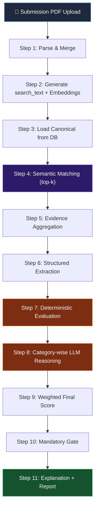

# Submission Evaluation Engine — Implementation Plan

## Overview

Build a complete bidder submission evaluation pipeline that takes a submission PDF, parses it identically to tender ingestion, semantically matches submission evidence against classified canonical criteria, runs deterministic + LLM-scored evaluations, and produces a standardized explainable report.

---

## Architecture



---

## Files to Create / Modify

### New Files

| # | File | Purpose |
|---|------|---------|
| 1 | `app/api/routes/submission.py` | Upload endpoint + trigger evaluation |
| 2 | `app/services/submission_service.py` | Orchestrates the full submission pipeline |
| 3 | `app/services/matching_service.py` | Semantic vector similarity matching |
| 4 | `app/services/extraction_service.py` | Structured value extraction (amounts, %, booleans) |
| 5 | `app/evaluators/numeric_evaluator.py` | Numeric threshold comparisons |
| 6 | `app/evaluators/boolean_evaluator.py` | Yes/No compliance checks |
| 7 | `app/evaluators/document_evaluator.py` | Document presence verification |
| 8 | `app/evaluators/experience_evaluator.py` | Experience/project threshold checks |
| 9 | `app/services/llm_scoring_service.py` | Category-wise LLM reasoning scores |
| 10 | `app/services/report_service.py` | Final report generation |

### Modified Files

| File | Change |
|------|--------|
| `app/api/main.py` | Register submission router |
| `app/services/embedding_service.py` | Add `build_submission_embeddings()` |
| `app/evaluators/rules_engine.py` | Replace placeholder with real dispatch |
| `app/evaluators/scorer.py` | Replace placeholder with weighted scoring |

---

## Implementation Phases

### Phase 1: Submission Ingestion (Steps 1-2)

**Files:** `submission.py`, `submission_service.py`, `embedding_service.py`

Parse submission PDF using the same 4-parser pipeline + merger.
For each evidence, build:
```
search_text = " | ".join(filter(None, [heading, key_norm, value_norm, text_norm]))
```
Generate embeddings with `sentence-transformers`.
Save to MongoDB `submission_evidence` collection.

### Phase 2: Semantic Matching (Steps 3-5)

**File:** `matching_service.py`

- Load canonical criteria from `canonical_tenders` collection
- For each canonical item, compute cosine similarity against all submission embeddings
- Return top-k=5 matched submission evidence per criterion
- Aggregate split evidence (merge adjacent chunks about the same thing)

### Phase 3: Structured Extraction (Step 6)

**File:** `extraction_service.py`

From matched evidence, extract structured values:
- Amounts: `5 lakh → 500000`, `5 crore → 50000000`
- Percentages: `50% → 50`
- Booleans: `Yes → true`, `No → false`
- Counts: project counts, years
- Document names: GST, PAN, ISO, etc.

### Phase 4: Deterministic Evaluation (Step 7)

**Files:** `numeric_evaluator.py`, `boolean_evaluator.py`, `document_evaluator.py`, `experience_evaluator.py`

Each evaluator returns:
```json
{
  "verdict": "PASS | FAIL | NEEDS_MANUAL_REVIEW",
  "score": 0.0-1.0,
  "reason": "...",
  "expected": "...",
  "found": "..."
}
```

### Phase 5: LLM Reasoning + Final Score (Steps 8-10)

**Files:** `llm_scoring_service.py`, `scorer.py`

- Group criteria by category
- Send batch to LLM for reasoning score (0-100)
- Weighted formula: `final = 0.7 * deterministic + 0.3 * llm_score`
- Category weights: Technical 30%, Financial 25%, Experience 20%, Legal 15%, Commercial 10%
- Mandatory gate: any mandatory FAIL → NOT_ELIGIBLE

### Phase 6: Report Generation (Step 11)

**File:** `report_service.py`

Standardized JSON report with:
- Overall score + verdict
- Category-wise breakdown
- Criterion-wise detail (evidence, values, comparison, verdict)
- Audit trail (source evidence IDs, page numbers)

---

## MongoDB Collections (New)

| Collection | Purpose |
|-----------|---------|
| `submissions` | Submission metadata + status |
| `submission_evidence` | Parsed & embedded submission evidence |
| `evaluation_reports` | Full evaluation report per submission |

---

## API Endpoints (New)

| Method | Path | Description |
|--------|------|-------------|
| POST | `/submission/upload` | Upload submission PDF for a tender |
| GET | `/submission/{submission_id}/status` | Check evaluation progress |
| GET | `/submission/{submission_id}/report` | Get full evaluation report |
| GET | `/tender/{tender_id}/submissions` | List all submissions for a tender |

---

## Category Weights

| Category | Weight |
|----------|--------|
| Technical Specifications | 30% |
| Financial Thresholds & Stability | 25% |
| Experience & Capability | 20% |
| Legal & Compliance | 15% |
| Commercial / Tender Terms | 10% |

---

## Status Progression

```
UPLOADED → PARSING → MERGING → EMBEDDING → MATCHING → EVALUATING → LLM_SCORING → SCORING → READY
```

> [!IMPORTANT]
> This plan builds on the existing tender ingestion pipeline. All parsers, merger, and embedding infrastructure are reused. The new work is matching + evaluation + scoring + reporting.
